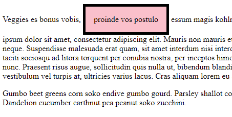
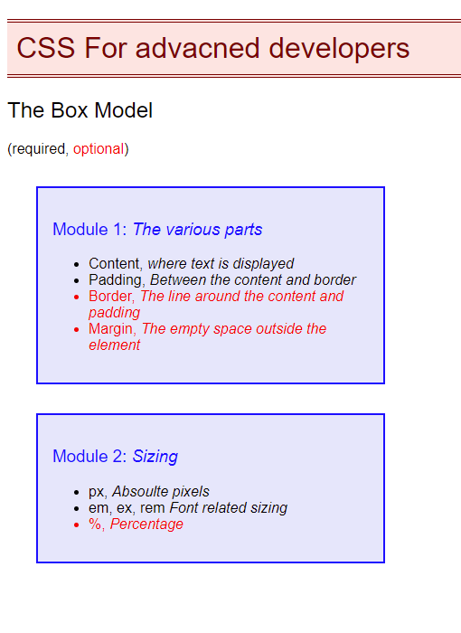
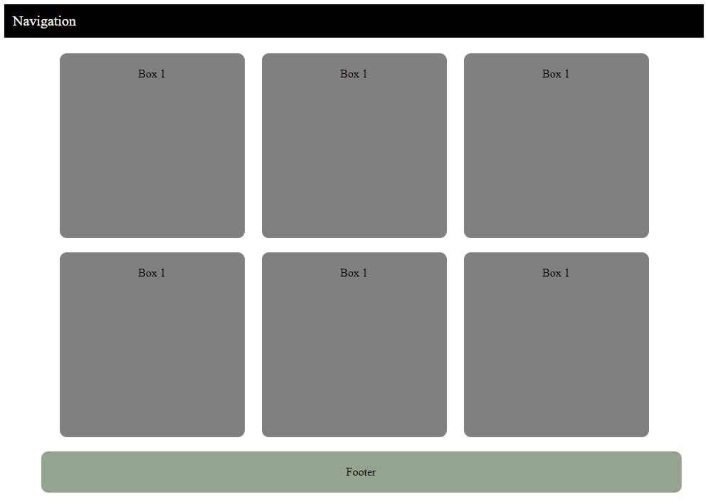
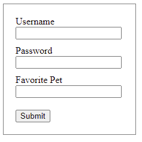
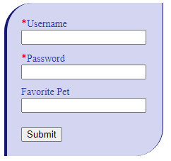
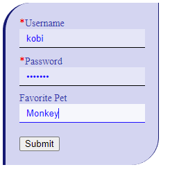
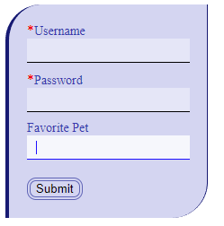

# Exercise 3 - Box Model

## Overview
In this exercise we will practice The CSS Box Model.

## Getting Started
In each of these exercises, you have an `html` file with a `<style>` section. In each file you have a problem which you should fix only by modifying the CSS.

## Steps
1. in `1.html` the text inside the `` runs over the wrapped text.    Fix the CSS so that it looks like this:  

2. in `2.html` you have a page that looks like this:    Make the required changes to make it look like this:  

3. in `3.html` you have a page that looks like this:    Make the required changes to make it look like this:  

## BONUS CHALLENGES
~~~
You may need to research some other selectors and properties
~~~
4. In file `4.html` you have a form that looks like this:  

    - Make the required changes to make the form look like this: 
     
    - Now make the required changes to make the labels and form look like this: 
    
    - Make the required changes so that the inputs will look like this. **NOTE** Notice the special appreance the input has when it is in focus. **NOTE 2** Notice that there is a special property called `outline` that is responsible for the initial focus style, which you will have to modify as well. 
    ]
    - Finally, make the required changes to make the button appear like this. 
     
    Also make sure that on hover, the button will look like this:  
    
