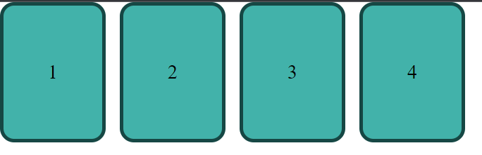
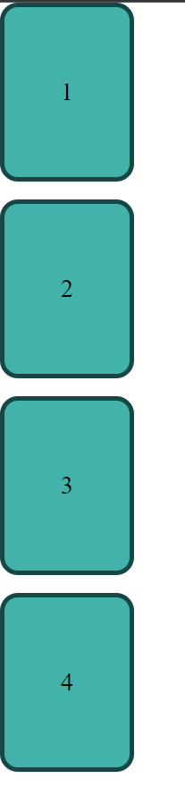

2. in `2.html` you have a page that looks like this:    Make the required changes to make it look like this:  
But notice that when ther is not enough space, they need to wrap in the following way:
 
 
 
