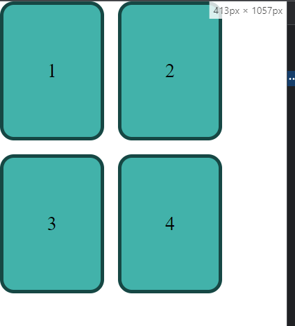

# Exercise 7 - Grid

## Overview
In this exercise we will practice CSS Grid.

## Getting Started
In each of these exercises, you have an `html` file with a `<style>` section. In each file you have a problem which you should fix only by modifying the CSS.

## Steps
1. in `1.html` We have a toolbar, sidebar, footer and the main area.  
 
to arrange it like this:  
 

2. in `2.html` you have a page that looks like this:    Make the required changes to make it look like this:  
But notice that when ther is not enough space, they need to wrap in the following way:
 
 
 

1. in `3.html` you have a page containing some  `
` tags.  
 
Make the required changes to make it look like this: 
 

